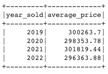

# Home_Sales
Module 22 Challenge

## Background
In this challenge, we used our knowledge of SparkSQL to determine key metrics about home sales data. Then we used Spark to create temporary views, partition the data, cache and uncache a temporary table, and verify that the table has been uncached.

## Data Source
https://2u-data-curriculum-team.s3.amazonaws.com/dataviz-classroom/v1.2/22-big-data/home_sales_revised.csv

## Instructions
#### Read the home_sales_revised.csv data into a Spark DataFrame.

#### Create a temporary table called home_sales and answer the following questions using SparkSQL:

What is the average price for a four-bedroom house sold for each year? Round off your answer to two decimal places.

What is the average price of a home for each year it was built that has three bedrooms and three bathrooms? Round off your answer to two decimal places.

What is the average price of a home for each year that has three bedrooms, three bathrooms, two floors, and is greater than or equal to 2,000 square feet? Round off your answer to two decimal places.

What is the "view" rating for homes costing more than or equal to $350,000? Round off your answer to two decimal places. 

Determine the run time for this query.
* Temporary table runtime:

#### Cache your temporary table home_sales.

Using the cached data, run the query that filters out the view ratings with an average price of greater than or equal to $350,000. Determine the runtime and compare it to uncached runtime.
* Cached runtime:

#### Partition by the "date_built" field on the formatted parquet home sales data and create a temporary table for the parquet data.
Run the query that filters out the view ratings with an average price of greater than or equal to $350,000. Determine the runtime and compare it to uncached runtime.
* Parquet data runtime:

#### Uncache the home_sales temporary table and verify that the home_sales temporary table is uncached using PySpark.

## Conclusion: 
Using SparkSQL with a temporary table had the longest query runtime for this data at .221 seconds. Using the cached temporary table was faster at .158 seconds. Partitioning by the "date_built" field on the formatted parquet home sales data and then creating a temporary table for the parquet data produced the fastest query time of .130 seconds.

